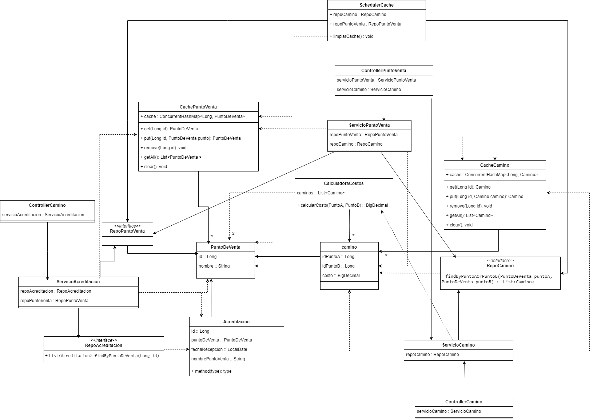

# Challenge-java

## Descripción del Proyecto

### Autor : Dante Ball

### Tecnologías

- **Java 17**
- **Spring Boot**
- **MySQL**
- **Hibernate**
- **JPA**
- **Maven**
- **JUnit**

### Base de Datos
puerto utilizado por la base de datos: 3306

nombre de la base de datos: challengejava (no es necesario crearla, se crea automaticamente)

usuario: root

password: root

### Instrucciones
una vez configurada la base de datos, se debe correr el challengejavaAplication.java

## Aclaraciones de diseño
### persistencia
si bien no se pedia persistir los puntos de venta y los caminos, tuve que persistirlos 
para poder mantener la cache actualizada, ya que tenia pensado hacer un LoadBalancer
pero no me dio el tiempo para terminarlo.

Esto hubiera sido mas simple si supiera usar Redis, lo que me hubiera permitido tener una unica cache.
Conozco la tecnologia pero nunca la implemente, por lo que no me parecio correcto aprenderla a usar para este ejericio.

### Cache
Se utiliza el patron singleton para tener una unica Cache en la aplicacion. A su vez se cuenta
con la clase "SchedulerCache" que se encarga de actualizar la cache cada 5 minutos. Esto pierde
un poco el sentido ya que al no tener el LoadBalancer no es necesario, ya que la cache se actualiza
cada vez que se inserta o actualiza un camino o punto de venta. era una idea que tenia para mantener la cache 
actualizada entre instancias de la aplicacion.

### Testing
Se realizaron test unitarios para la calculadora de costos, tambien tenia para los servicios
pero los tuve que eliminar, ya que al principio pensaba utilizar SpringCache, pero surgio un percance
y decidi pasar al los singleton por cuestiones de tiempo.

### Puntos y Caminos
Se asume que al eliminar un punto de venta se eliminan sus caminos asociados.

### Acreditaciones
La fecha de recepcion de la acreditacion se recibe en formato "d-m-yyyy" 
No me quedo claro si la fecha la asignaba la API o el usuario, por lo que asumi que la asignaba el usuario.


## Endpoints

### PuntoDeVenta
- **GET /puntos**: Obtiene todos los puntos de venta.
- **GET /puntos/{id}**: Obtiene un punto de venta por ID.
- **GET /puntos/{id}/caminos**: Obtiene todos los caminos para un punto de venta.
- **POST /puntos**: Crea un nuevo punto de venta.
  - **Body de Ejemplo**:
    ```json
    {
      "nombre": "Punto de Venta 1"
    }
    ```
- **PUT /puntos/{id}**: Actualiza un punto de venta existente.
  - **Body de Ejemplo**:
    ```json
    {
      "nombre": "Punto de Venta Actualizado"
    }
    ```
- **DELETE /puntos/{id}**: Elimina un punto de venta por ID y sus caminos asociados.

### Camino
- **GET /caminos**: Obtiene todos los caminos.
- **GET /caminos/{id}**: Obtiene un camino por ID.
- **POST /caminos**: Crea un nuevo camino.
  - **Body de Ejemplo**:
    ```json
    {
      "idPuntoVentaA": 1,
      "idPuntoVentaB": 2,
      "costo": 100.50
    }
    ```
- **DELETE /caminos/{id}**: Elimina un camino por ID.

### Cálculo de Costos
- **POST /caminos/calcularCosto**: Calcula el costo mínimo entre dos puntos de venta.
  - **Body de Ejemplo**:
    ```json
    {
      "puntoA": 1,
      "puntoB": 2
    }
    ```

### Acreditación
- **GET /acreditaciones**: Obtiene todas las acreditaciones.
- **GET /acreditaciones/{id}**: Obtiene una acreditación por ID.
- **POST /acreditaciones**: Crea una nueva acreditación.
  - **Body de Ejemplo**:
    ```json
    {
      "idPuntoVenta": 1,
      "importe" : 100,
      "fechaRecepcion" : "15-1-2025"
    }
    ```

## Diagrama de Clases
